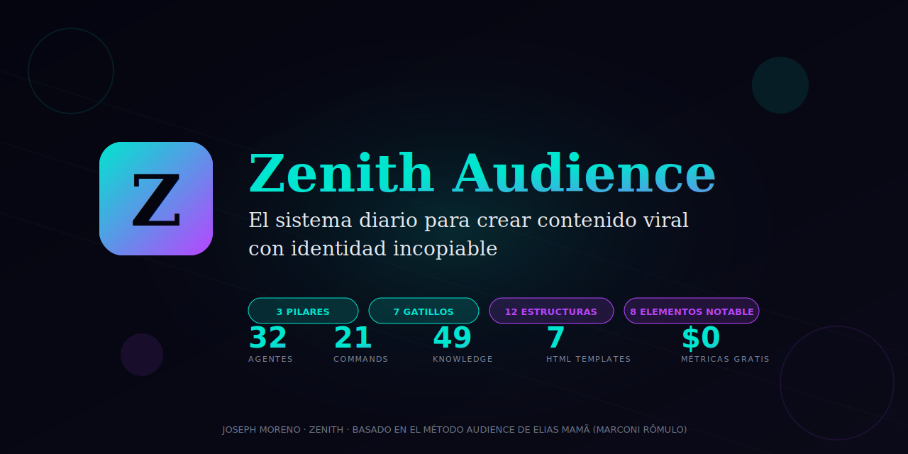
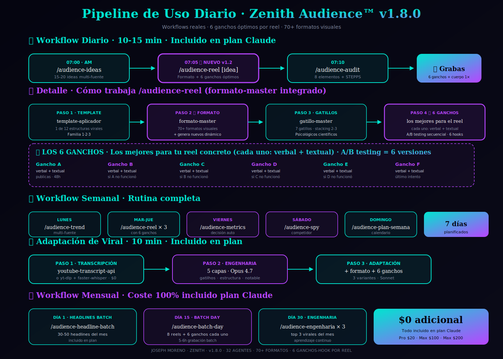

<div align="center">



# Zenith Audience™

### Sistema diario para crear contenido viral con identidad incopiable

**29 agentes · 15 commands · 32 knowledge files · 7 HTML templates estéticos · 100% gratis**

[](https://opensource.org/licenses/MIT)
[](https://claude.com/claude-code)
[](https://github.com/zenithmetodo/zenith-audience/releases)
[](#stack-100-gratis)

**[INSTALAR](#instalación) · [USO DIARIO](#uso-diario) · [LOS 12 TEMPLATES](#los-12-templates-virales) · [METRICOOL](#métricas-metricool-free) · [APIFY](#apify-research-free)**

</div>

---

## ¿Qué es Zenith Audience?

**Zenith Audience™** es un mega-plugin de Claude Code que implementa **el Método Audience completo** de Elias Mamã (Marconi Rômulo) en un sistema operativo de uso diario.

> *Adaptado y compilado por Joseph Moreno · Marca Zenith*

### El problema que resuelve

La mayoría de creadores conocen los conceptos (gatilhos · estructuras · notable) pero **no logran ejecutarlos consistentemente** en su día a día. Resultado:
- Contenido genérico que no convierte
- Bloqueo creativo diario
- Frameworks copiados mal
- Quemar tokens en LLMs sin sistema

### La solución Zenith

**29 agentes especializados** + **15 slash commands** orquestados como sistema operativo diario · cada uno crack de UNA cosa · todos coordinados.

---

## La fórmula completa

```
GATILLOS DE ATENCIÓN (7)
        +
CONTENIDO NOTABLE (8 elementos)
        +
NÚCLEO DE INFLUENCIA (10 preguntas)
        +
CONSISTENCIA (sistema diario Zenith)
        =
AUDIENCIA ORGÁNICA QUE TE RESPETA · CONFÍA · COMPRA
```

---

## Arquitectura del sistema

<div align="center">

</div>

### 9 bloques de agentes

| Bloque | Función | Agentes |
|---|---|---|
| **A · Investigación** | Spy competidor · trends · engenharia reversa · ideas ganadoras ⭐ | 6 |
| **B · Núcleo Influencia** | Setup one-shot · 10 preguntas | 5 |
| **C · Asuntos Virales** | Validación · ideación diaria · pesquisa magnética | 3 |
| **D · Gatillos & Headlines** | 7 gatillos · 3 tipos headline · plan batch | 3 |
| **E · 12 Estructuras** | Selector · aplicador · rotation planner | 3 |
| **F · Creación** | Reel · carrusel · hilo | 3 |
| **G · Notable** | Auditor + builder · 8 elementos + STEPPS | 2 |
| **H · Métricas** | Metricool MCP + iteración de ganadores | 2 |
| **I · Planificación** | Plan semana · batch day | 2 |

**Total: 29 agentes coordinados por 15 slash commands.**

---

## Pipeline de uso diario

<div align="center">

</div>

### 🌅 Día tipo · 10 min · ~$0.20

```bash
07:00 → /audience-ideas        → 20 ideas hoy ($0.05)
07:05 → /audience-reel [idea]  → guion completo HTML ($0.12)
07:08 → /audience-audit        → checklist final ($0.03)
07:10 → Grabas y publicas
```

### 📅 Semana tipo · ~$4.50

```
Lunes      → /audience-trend (multi-fuente)
Mar-Jue    → /audience-reel × 3
Viernes    → /audience-metrics + iterar ganadores
Sábado     → /audience-spy @competidor
Domingo    → /audience-plan-semana
```

### ⭐ Adaptar viral · 10 min · ~$0.80

```bash
/audience-adaptar https://instagram.com/reel/XXXXX/
```

→ Transcribe · analiza · extrae idea ganadora · adapta a TU núcleo · 3 variantes (reel + carrusel + hilo)

---

## Los 12 Templates Virales

**Mes y medio sin repetir el mismo template.** 3 familias · 12 fórmulas verificadas:

### Familia 1 · Ultra-Especificidad

| # | Template | Fórmula | Ejemplo canónico |
|---|---|---|---|
| 1 | **Ultra-específico** | `[VERBO] + [OBJETO ULTRA] + [CONTEXTO]` | "Toma creatina 30 min ANTES del entreno" |
| 2 | **Autoridad** | `[HÁBITO] + después de [FUENTE]` | "Cosas que ya no hago tras estudiar neurociencia" (2M views) |
| 3 | **Parecen normales** | `[Producto común] + parece bueno + consecuencia` | "Alimentos que parecen sanos pero traban el intestino" |
| 4 | **Mayor motivo** | `MAYOR MOTIVO por el que [dolor]` | "Mayor motivo por el que mujer 40+ no logra emagrecer" |

### Familia 2 · Disrupção

| # | Template | Fórmula | Ejemplo |
|---|---|---|---|
| 5 | **Invalidar creencia** | `La creencia sobre X está EQUIVOCADA` | "USA es uno de los PEORES países" (3M views · Roberto Spigel) |
| 6 | **Enemigo puso la mano** | `[Enemigo] puso mano en [cosa] y cambió` | "El funqueiro puso la mano en la Lacoste..." |
| 7 | **Enemigo adora/odia** | `Lo que [enemigo] ADORA/ODIA que hagas` | "Lo que el abusador ADORA que las mujeres hagan" |
| 8 | **Llevé X años** | `Demoré [N años] · enseño en [Y seg]` | "Demoré 60 años para aprender esto sobre Dios" |

### Familia 3 · Autoridade + Mistério

| # | Template | Fórmula | Ejemplo |
|---|---|---|---|
| 9 | **Características ultra-específicas** | `Toda persona con [X] necesita esto antes de [DEADLINE]` | "Toda mujer 50+ antes que tenga Alzheimer" |
| 10 | **Autoridad en X** | `[N COSAS] son AUTORIDAD en [SITUACIÓN]` | "Películas que son facultad de oratoria" (Fabi Bert) |
| 11 | **La próxima vez X** | `Próxima vez que [hagas X] · NO Y · haz Z` | "Próxima conversación · NO mires a los ojos" |
| 12 | **Transforma X en Y** | `[N COSAS] que TRANSFORMAN [antes] en [después]` | "4 marinadas que transforman tu pollo" |

**Cada template tiene su knowledge file completo en `knowledge/templates/` con fórmula + ejemplos + cuándo SÍ usar + cuándo NO usar + variaciones + errores comunes.**

---

## Los 7 Gatillos de Atención

| # | Gatillo | Activa | Stacking típico |
|---|---|---|---|
| 1 | **Recompensa** | Dopamina por expectativa | + Autoridad (Lili) |
| 2 | **Misterio** | Brecha información | + Creencia (paredes grises) |
| 3 | **Reconocimiento** | "Esto es para mí" | + Recompensa (45+ menopausia) |
| 4 | **Popularidad** | Bandwagon · tribu | + Disrupción (Trump visas) |
| 5 | **Creencia** | Pertenencia + validación | + Autoridad |
| 6 | **Autoridad** | Obediencia automática | + Disrupción (cardiólogo) |
| 7 | **Disrupción** | Alerta cerebral | + Autoridad (Neymar Al-Hilal) |

**Regla:** nunca uses 1 solo gatillo · mínimo 2-3 (stacking).

---

## Los 8 Elementos del Notable

1. **Valor práctico** (replicable + útil)
2. **Puntos de identificación** ("esto soy yo")
3. **Opiniones fuertes** (polarización propósito)
4. **Argumentaciones poderosas** (munición debate)
5. **Noticias** (atención prestada momento)
6. **Historias** (emociones > lógica)
7. **Pruebas** (estudios · antes/después)
8. **Hechos curiosos** ("wow no sabía eso")

**Regla:** mínimo 2-3 elementos por vídeo · ideal 4-5.

---

## Núcleo de Influencia · 10 preguntas

Setup ONE-SHOT al inicio (2-3h):

1. ¿Quién eres tú? · 2. ¿Historia de creación? · 3. ¿A quién ayudas? · 4. ¿Qué dolor resuelves? · 5. ¿Promesa de transformación? · 6. ¿Quién es tu enemigo? · 7. ¿Qué creencias defiendes? · 8. ¿Cuáles son tus pruebas? · 9. ¿Bordones · lenguaje propio? · 10. ¿Tu verdadero yo?

**Comando:** `/audience-setup`

---

## Los 15 Slash Commands

| Command | Función | Coste |
|---|---|---|
| `/audience-setup` | Setup núcleo influencia one-shot | ~$0.40 |
| `/audience-ideas` | 20 ideas para hoy | $0.05 |
| `/audience-trend` | Trends multi-fuente | $0.55 |
| `/audience-spy [@handle]` | Análisis competidor | $0.80 |
| `/audience-adaptar [url]` ⭐ | Adaptar viral a tu núcleo | $0.60 |
| `/audience-headline [tema]` | 10 headlines (3 tipos) | $0.08 |
| `/audience-reel [tema]` | Guion completo reel | $0.15 |
| `/audience-carrusel [tema]` | Carrusel 8-10 slides | $0.12 |
| `/audience-hilo [tema]` | Thread X/IG/LinkedIn | $0.10 |
| `/audience-audit [guion]` | Audit notable + 5 criterios | $0.03 |
| `/audience-iterar [post]` | 10 variantes de viral | $0.50 |
| `/audience-metrics` | Reporte Metricool | $0.04 |
| `/audience-plan-semana` | Calendario semanal | $0.10 |
| `/audience-batch-day` | Plan grabación batch | $0.20 |
| `/audience-engenharia [url]` | Engenharia reversa 5 capas | $0.40 |

---

## Stack 100% Gratis

### Métricas · Metricool MCP Free

- **Plan Free permanente:** 1 marca · IG + TT + YT + FB + Pinterest + Threads + Bluesky + Twitch
- **30 días histórico** · 5 competidores · 20 contenidos planificados/mes
- **MCP oficial** · una sola conexión OAuth
- Empresa española · soporte en castellano

### Research · Apify Free

- **$5/mes gratis** (~2000 scrapes · suficiente para uso individual)
- Scrapers TT · IG · YT para spy competidores · trending

### Trends · APIs oficiales gratis

- **Google Trends** vía `pytrends` (gratis · sin API key)
- **Reddit** vía `PRAW` (gratis · oficial)
- **YouTube** Data API v3 (gratis · 10K cuota/día)

### Transcripción · 100% local · gratis

- `youtube-transcript-api` (YouTube · instant)
- `yt-dlp` + `faster-whisper` (IG/TT · local · ES+PT+EN)

**Coste total mensual: $20-25 (solo API Claude) + Apify Free + Metricool Free**

---

## Knowledge Library · 32 archivos

```
knowledge/
├── core/                           (5) · pilares · algoritmos · misión
├── gatillos/                       (8) · 7 gatillos + overview
├── asuntos-virales/                (3) · 6 categorías + 3 tipos + 5 criterios
├── headlines/                      (2) · 3 tipos + plan creación
├── templates/                      (12) · 1 archivo por estructura
├── notable/                        (2) · 8 elementos + Berger STEPPS
└── nucleo-influencia/              (2) · 10 preguntas + verdadero yo
```

Cada knowledge internalizado en system prompt de los agentes (estilo Custom GPT). Cero re-lectura en runtime = cero tokens desperdiciados.

---

## Instalación

### Opción 1 · Auto-install (recomendado)

```bash
# macOS / Linux
curl -fsSL https://raw.githubusercontent.com/zenithmetodo/zenith-audience/main/install.sh | bash

# Windows PowerShell
iwr -useb https://raw.githubusercontent.com/zenithmetodo/zenith-audience/main/install.ps1 | iex
```

### Opción 2 · Manual con Claude Code

```bash
# Marketplace
/plugin marketplace add https://github.com/zenithmetodo/zenith-audience
/plugin install zenith-audience
```

### Opción 3 · Clone directo

```bash
mkdir -p ~/.claude/plugins
git clone https://github.com/zenithmetodo/zenith-audience.git ~/.claude/plugins/zenith-audience
```

### Setup post-instalación

```bash
# 1. Dependencias Python (opcionales · para scripts trends/transcripción)
pip install -r requirements.txt

# 2. Metricool MCP (gratis)
claude mcp add --transport http metricool https://ai.metricool.com/mcp

# 3. Apify MCP (free $5/mes)
claude mcp add --transport http apify https://mcp.apify.com --header "Authorization=Bearer YOUR_APIFY_TOKEN"

# 4. Variables de entorno (.env)
cp .env.example .env
# Edita y añade:
# REDDIT_CLIENT_ID, REDDIT_CLIENT_SECRET
# YOUTUBE_API_KEY
# APIFY_TOKEN
```

Setup detallado: ver [INSTALL.md](INSTALL.md) · [METRICOOL_SETUP.md](METRICOOL_SETUP.md) · [APIFY_SETUP.md](APIFY_SETUP.md) · [WHISPER_SETUP.md](WHISPER_SETUP.md)

---

## Uso Diario

### Primera vez (one-shot · 2-3h)

```bash
/audience-setup
```

Te guía las 10 preguntas del núcleo de influencia.

### Rutina diaria (10 min)

```bash
/audience-ideas
/audience-reel [idea elegida]
/audience-audit [guion]
```

### Rutina semanal

```bash
# Domingo (planificación)
/audience-plan-semana

# Lunes (trends)
/audience-trend

# Viernes (métricas + iteración)
/audience-metrics
/audience-iterar [post-ganador]
```

### Cuando ves un viral

```bash
/audience-adaptar https://instagram.com/reel/XXXXX/
```

→ 3 variantes adaptadas a TI (reel + carrusel + hilo) con análisis "por qué funcionará" + "en qué se basa"

---

## Filosofía Zenith

1. **Consistencia > perfección.** Publica imperfecto antes que esperar lo perfecto.
2. **Específico > genérico.** Cuanto más específico · más viral.
3. **Polariza con propósito.** Opiniones fuertes ganan tribu · no neutralidad.
4. **Sirve al avatar · no al algoritmo.** El algoritmo premia lo que sirve al avatar.
5. **Adapta · no copies.** La idea ganadora se adapta al Verdadero Yo · nunca se copia.

---

## Coste Total Mensual

| Concepto | Coste |
|---|---|
| Claude API (uso intenso diario) | ~$20-25 |
| Metricool plan Free | **$0** |
| Apify Free $5/mes | **$0** (dentro del free) |
| Whisper · pytrends · PRAW · YT API | **$0** (todo gratis) |
| **TOTAL** | **~$20-25/mes** |

vs **1 hora de creative agency = $100+**. ROI brutal.

---

## Comparativa vs otros sistemas

| Enfoque común | Zenith Audience |
|---|---|
| "Postea mucho" | Postea **estructurado** (12 templates probados) |
| Engagement bait | **Notable real** (8 elementos) |
| Copia lo viral | **Adapta al Verdadero Yo** |
| Trucos de algoritmo | **Psicología del cerebro** (7 gatillos) |
| "Sigue trends" | **Construye narrativa de marca** |
| Herramientas dispersas | **Sistema operativo unificado** |

---

## Contribuir

Ver [CONTRIBUTING.md](CONTRIBUTING.md). PRs bienvenidas para:
- Nuevos templates virales detectados
- Ejemplos canónicos de otros nichos
- Mejoras de prompts
- Scripts de scraping adicionales
- Traducciones (PT · EN)

---

## Hermano de plugins

**Zenith Crea Ofertas™** — el sistema complementario para crear ofertas de alto valor percibido a partir del avatar definido en tu núcleo de influencia.

→ [github.com/zenithmetodo/zenith-crea-ofertas](https://github.com/zenithmetodo/zenith-crea-ofertas)

---

## Atribución

El **Método Audience** original es de **Elias Mamã (Marconi Rômulo)** y su equipo. Este plugin es una **adaptación operativa** al ecosistema Claude Code por **Joseph Moreno · Zenith**. Todo crédito conceptual y pedagógico pertenece a Elias Mamã.

### Stack técnico
- **Anthropic Claude** (Opus 4.7 · Sonnet 4.6 · Haiku 4.5)
- **Metricool** (métricas multi-plataforma)
- **Apify** (scraping)
- **pytrends · PRAW · YouTube API · youtube-transcript-api · yt-dlp · faster-whisper** (todo open source gratis)

---

## License

MIT License · ver [LICENSE](LICENSE).

---

<div align="center">

**Construido por Joseph Moreno · Zenith · 2026**

[Website](https://zenith.com) · [Twitter](https://twitter.com/zenithmetodo) · [GitHub](https://github.com/zenithmetodo)

⭐ **Si te ayuda · dale una estrella en GitHub** ⭐

</div>
